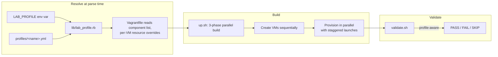
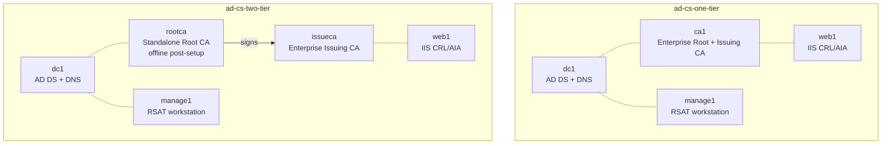
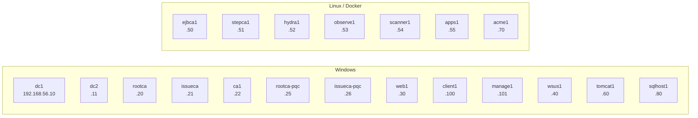
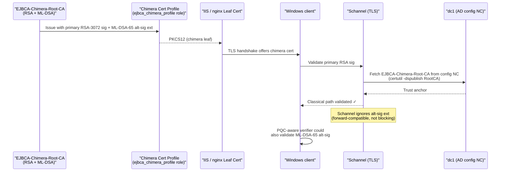
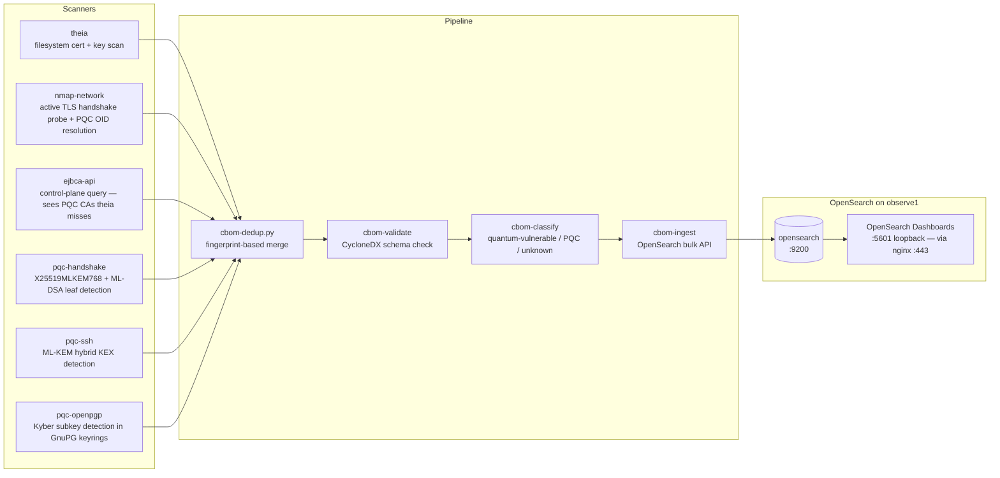
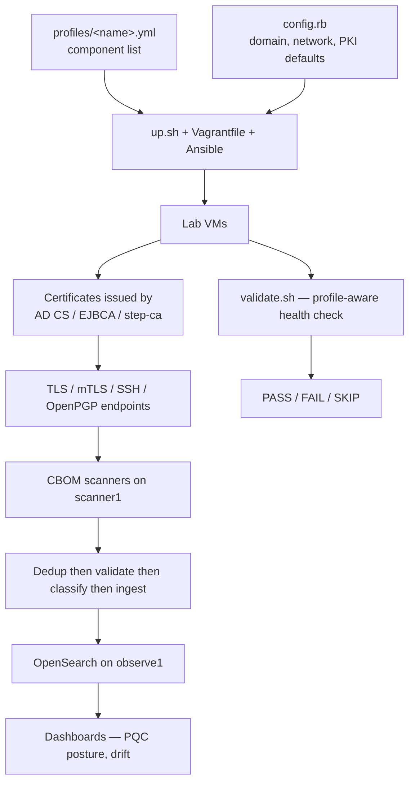

# Straylight Architecture

Data flow, topology variants, and PQC surface coverage, including the parallel ML-DSA AD CS hierarchy (`pqc-adcs-two-tier`) and the declarative topology/profile model. Design history: [docs/architecture-evolution.md](docs/architecture-evolution.md). Build instructions: [README.md](README.md) and [vagrant/GETTING-STARTED.md](vagrant/GETTING-STARTED.md); demo narrative: [vagrant/docs/pqc-demo-runbook.md](vagrant/docs/pqc-demo-runbook.md).

## Composition model

The lab is **one Vagrantfile + composable YAML profiles**. There is no per-topology directory.

> 🖌️ **Editable draw.io:** [`docs/diagrams/composition-model.drawio.svg`](docs/diagrams/composition-model.drawio.svg)

`scripts/lib/profile-helper.sh` is the bash counterpart of `lib/lab_profile.rb`; `up.sh`, `nuke.sh`, `snap.sh`, and `validate.sh` source it to resolve `LAB_PROFILE` → `VAGRANT_DOTFILE_PATH` + VBox name prefix + component list.

## Host platform

**Linux host only** — Ubuntu 22.04+ baseline. Windows and macOS were evaluated and declined (no VirtualBox Apple-Silicon support; WSL2 → VirtualBox host-only networking is unguaranteed); from those platforms, run Straylight inside a Linux VM or on a remote Linux host.

## Topology variants

Two AD CS topologies (one-tier, two-tier), plus a third variant: classical two-tier alongside a parallel ML-DSA PQC hierarchy (`pqc-adcs-two-tier`: `rootca-pqc` + `issueca-pqc`). Selection is purely by which CA VMs the profile includes.

> 🖌️ **Editable draw.io:** [`docs/diagrams/topology-variants.drawio.svg`](docs/diagrams/topology-variants.drawio.svg)

Two-tier matches enterprise best practice: root CA offline after signing the subordinate, issuing CA rebuildable without replacing root trust. One-tier collapses both into a single CA (`ca1`) for compactness.

## VM inventory (full superset — 20 VMs defined)

**This table is the authoritative human-readable VM inventory**, CI-checked against `vagrant/topology.yml` (the single machine source of truth): `vagrant/test/doc_inventory_test.rb` fails the build if name/IP/OS drift. Other docs link here rather than restating the fleet.

| VM | IP | OS | Role |
|----|----|----|------|
| `dc1` | 192.168.56.10 | Windows | AD DS + DNS (forest root) |
| `dc2` | 192.168.56.11 | Windows | Secondary domain controller (AD DS replication) |
| `rootca` | 192.168.56.20 | Windows | Standalone Root CA (two-tier; offline post-signing) |
| `issueca` | 192.168.56.21 | Windows | Enterprise Issuing CA (two-tier) |
| `ca1` | 192.168.56.22 | Windows | Enterprise Root+Issuing CA (one-tier) |
| `rootca-pqc` | 192.168.56.25 | Windows | ML-DSA-87 Standalone Root CA (PQC hierarchy) |
| `issueca-pqc` | 192.168.56.26 | Windows | ML-DSA-65 Enterprise Issuing CA (PQC hierarchy) |
| `web1` | 192.168.56.30 | Windows | IIS CRL/AIA (CDP) distribution point |
| `wsus1` | 192.168.56.40 | Windows | WSUS update server (golden-master cache) |
| `ejbca1` | 192.168.56.50 | Linux | EJBCA CE (Docker) — independent PKI + PQC issuance |
| `stepca1` | 192.168.56.51 | Linux | Smallstep step-ca (Docker) — ACME-native CA |
| `hydra1` | 192.168.56.52 | Linux | Ory Hydra (Docker) — OAuth 2.0 / OIDC |
| `observe1` | 192.168.56.53 | Linux | OpenSearch + Dashboards + CBOM ingest |
| `scanner1` | 192.168.56.54 | Linux | CBOM scanners + pure-PQC mTLS client |
| `apps1` | 192.168.56.55 | Linux | General application host |
| `tomcat1` | 192.168.56.60 | Windows | Apache Tomcat (Java keystore PKI) |
| `acme1` | 192.168.56.70 | Linux | ACME client sandbox (step CLI + acme.sh) |
| `sqlhost1` | 192.168.56.80 | Windows | SQL Server host (cert-auth labs) |
| `client1` | 192.168.56.100 | Windows | Windows 11 test client (autoenrollment) |
| `manage1` | 192.168.56.101 | Windows | Windows management jump box (RSAT) |

> 🖌️ **Editable draw.io:** [`docs/diagrams/vm-inventory.drawio.svg`](docs/diagrams/vm-inventory.drawio.svg)

Each profile (`vagrant/profiles/*.yml`) picks a subset and overrides per-VM memory/CPU. Of the **20 VMs** defined, the `full` profile ships **18**: `rootca-pqc` and `issueca-pqc` ship only in `pqc-adcs-two-tier` / `pqc-full`.

## PQC feature matrix

What's quantum-safe today, across the lab's protocol surfaces.

| Surface | Status | Endpoint(s) | Algorithm | Profile |
|---|---|---|---|---|
| **TLS — pure ML-DSA** | Ships | observe1:8444, stepca1:9444, ejbca1:8444, hydra1:8444 | ML-DSA-65 leaf, X25519MLKEM768 KEM | `pqc-linux`, `pqc-full` |
| **TLS — mTLS pure-PQC** | Ships | observe1:8445 (server) + scanner1 (client) | ML-DSA-65 server + client cert, openssl 3.5 `-Verify 1` | `pqc-full` |
| **TLS — chimera (RSA + ML-DSA alt-sig)** | Ships | web1:8443 (IIS), observe1:8443 (nginx) | RSA-3072 primary + ML-DSA-65 alt-sig X.509 v3 ext | `pqc-full` |
| **SSH — hybrid KEX** | Ships | All Linux VMs with OpenSSH 10 | `mlkem768x25519-sha256` | `pqc-linux`, `pqc-full` |
| **OpenPGP — Kyber encryption** | Ships | ejbca1, stepca1, hydra1, observe1 | Kyber-768 encryption subkey | `pqc-linux`, `pqc-full` |
| **OpenPGP — ML-DSA signing** | Pending upstream | n/a — GnuPG 2.5.x has no ML-DSA signing | _GnuPG 2.6.x roadmap_ | n/a |
| **CRL signing** | Classical | All CAs | RSA-3072 | All AD CS profiles |
| **OCSP** | Classical | n/a — AD CS OCSP not enabled in lab | _Future_ | n/a |
| **AD CS native PQC** | Ships (CA hierarchy) | rootca-pqc (standalone root), issueca-pqc (enterprise sub-CA) | ML-DSA-87 root, ML-DSA-65 sub-CA — gated on KB5087539 | `pqc-adcs-two-tier` |
| **AD CS PQC end-entity issuance** | Ships | ML-DSA leaf templates (`cert_templates_pqc`) | ML-DSA-65 leaf | `pqc-adcs-two-tier` |
| **EJBCA native PQC issuance** | Ships | EJBCA-PQC-Root-CA, EJBCA-PQC-Issuing-CA, EJBCA-Chimera-Root-CA | ML-DSA-65 CA keys, ML-DSA-65 issuance | `pqc-full` |
| **step-ca PQC** | Ships | stepca1 control plane | X25519MLKEM768 transport (TLS to control plane) | `pqc-full` |

Limitations: see [Known Limitations in the runbook](vagrant/docs/pqc-demo-runbook.md#known-limitations-read-this-first).

## Chimera cert flow (RSA + ML-DSA-65 alt-sig)

Chimera certificates carry two signatures, so classical-only and PQC-aware verifiers can both trust them without updating every consumer at once.

> 🖌️ **Editable draw.io:** [`docs/diagrams/chimera-cert-flow.drawio.svg`](docs/diagrams/chimera-cert-flow.drawio.svg) — visible SVG is faithful; embedded editable XML is an approximation (sequence diagrams don't round-trip cleanly).

Forest-wide trust: `certutil -dspublish RootCA` writes the chimera root cert into the AD Configuration Naming Context; Group Policy autoenrollment pushes it into every domain-joined machine's trust store at next refresh — no per-machine import.

## Trust anchor distribution & revocation

Per-anchor source of truth — *which* anchor reaches *which* trust store *how* — so distribution paths don't drift across the roles that own them.

| Trust anchor | Distributed by | Reaches | Notes |
|---|---|---|---|
| `YOURLAB-Root-CA` (classical root) | AD autoenrollment of the Enterprise PKI (root published to AD config NC at CA install) | every domain-joined machine's `Root` store | two-tier; root offline post-signing |
| `YOURLAB-PQC-Root-CA` (ML-DSA-87 root) | same AD config-NC path | domain machines' `Root` store | gated on KB5087539 |
| `EJBCA-Chimera-Root-CA` | `certutil -dspublish RootCA` → AD config NC → GPO autoenrollment | domain machines' `Root` store | deliberately *also* imported directly on hosts that must trust it before the next `gpupdate` |
| Smallstep / step-ca root | `/usr/local/share/ca-certificates/stepca-root.crt` + `update-ca-certificates` | Linux system trust (acme1, observe1) | ACME issuance chain |
| EJBCA PQC/issuing roots | file fetch into the OpenSSL 3.5 `-CAfile` chain bundle (`/opt/pqc-certs/ejbca-pqc-chain.pem`) | scanner1 / probe clients | not OS-trusted; explicit chain bundle |
| Beats TLS CA | staged with the Beats config | winlogbeat/filebeat → observe1:9244 | data-plane TLS only |

**CDP/AIA namespace:** the classical and ML-DSA hierarchies use separate revocation namespaces on the shared web1 host — classical at `http://pki.<domain>/crl` + `/aia`, ML-DSA at `http://pki.<domain>/crl/pqc` + `/aia/pqc`. `publish_ca_artifacts` writes each hierarchy's CRLs/certs into its own subdir (`publish_subdir`), so a revocation or CRL refresh in one hierarchy never touches the other's namespace.

**Revocation lifecycle:** online issuing CAs run a daily `certutil -CRL` republish to web1 via the `ca_crl_republish` role (the 26-week CRL validity is now a cushion, not the refresh mechanism). Revocation is exercised end-to-end in the [revocation walkthrough](docs/walkthroughs/labs/adcs-functest-4-revocation-walkthrough.md) — enroll → `certutil -revoke` → republish → confirm `CRYPT_E_REVOKED`.

## CBOM pipeline (observability)

Six scanners feed a unified CBOM into OpenSearch on observe1. Dashboards visualize PQC posture across the fleet.

> 🖌️ **Editable draw.io:** [`docs/diagrams/cbom-pipeline.drawio.svg`](docs/diagrams/cbom-pipeline.drawio.svg)

Seven dashboards render PQC readiness scores, cipher-suite breakdowns, certificate inventories, and cross-protocol PQC posture. Drill-down to per-host detail via the standard OSD index pattern `logs-*`.

## Data flow summary

> 🖌️ **Editable draw.io:** [`docs/diagrams/data-flow.drawio.svg`](docs/diagrams/data-flow.drawio.svg)

Both paths (lab build and CBOM observation) are profile-aware: the same scripts handle the 4-VM `core` and 13-VM `pqc-full` profiles without conditional branches in the invocation.

## Where to dig deeper

- **End-to-end session flow**: [docs/how-it-works.md](docs/how-it-works.md) — 8-stage lifecycle from clone to cleanup, per-stage diagrams.
- **Every config knob**: [docs/configuration.md](docs/configuration.md) — env vars, config.rb, profile YAMLs, role defaults.
- **Ansible role catalog**: [vagrant/ansible/roles/README.md](vagrant/ansible/roles/README.md)
- **CBOM design**: [vagrant/docs/cbom-pipeline.md](vagrant/docs/cbom-pipeline.md) + [vagrant/docs/cbom-toolkit-design.md](vagrant/docs/cbom-toolkit-design.md)
- **Topology + profile catalog**: [vagrant/docs/lab-topologies.md](vagrant/docs/lab-topologies.md)
- **PQC demo runbook**: [vagrant/docs/pqc-demo-runbook.md](vagrant/docs/pqc-demo-runbook.md)
- **How the architecture got here**: [docs/architecture-evolution.md](docs/architecture-evolution.md) — the consolidation that collapsed hand-synced duplications into single sources of truth.
