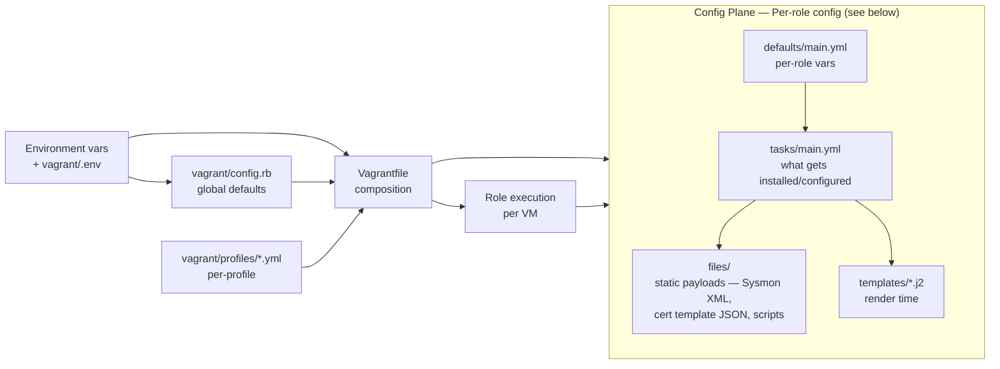

# Lab Configuration Reference

Every configuration surface in Straylight. **Overview** locates the right knob; **Detailed reference** gives exact field names, defaults, and how each value propagates.

## Overview

Configuration comes from layered sources, listed below in precedence order — sources nearer the top override those below them:

```
Environment variables                ←  highest priority (per-invocation)
vagrant/.env                         ←  persisted overrides
config.rb                            ←  global defaults
profiles/<name>.yml                  ←  per-profile component list + overrides
Ansible (ansible.cfg, requirements,  ←  inventory, role defaults, transports
  inventory, role defaults/templates)
Per-CA template variables            ←  CAPolicy.inf.j2 for each CA tier
Dev-time + CI config                 ←  .ansible-lint, .yamllint, workflows
Runtime artifacts                    ←  .env, dotfile state, snapshots
Config Plane (per-role, Windows +    ←  what every role installs / configures:
  Linux OS settings + app installs)      OS baseline, audit/Sysmon, choco/RSAT,
                                         cert templates, GPOs, AD forest, Docker
                                         apps, build-from-source PQC stack
Release / CI inputs                  ←  lowest priority (tagged releases, CI)
```

Windows config (DNS, audit, Sysmon, RSAT, cert templates, autoenrollment, AD forest), Linux app installs (EJBCA / step-ca / Hydra), and PQC source builds (OpenSSL 3.5, OpenSSH 10, GnuPG 2.5) all live in the [Config Plane](#config-plane--per-role-config-windows--linux-os-settings--app-installs).

### Where to set what

| Want to change… | Set it in… | Example |
|---|---|---|
| Which VMs are in your lab | `LAB_PROFILE` env or `LAB_COMPONENTS` env | `LAB_PROFILE=pqc-full ./up.sh` |
| Domain name / NetBIOS / IP prefix | env vars or `config.rb` | `LAB_DOMAIN=test.local LAB_NETWORK=192.168.57 ./up.sh` |
| Windows Server version | `WIN_SERVER_VERSION` env | `WIN_SERVER_VERSION=2022 ./up.sh` |
| Per-VM memory/CPU | `config.rb` `VM_DEFAULTS` or per-profile YAML `resources:` block | edit `VM_DEFAULTS` in `config.rb` |
| Disable logging shippers | `LOGGING_ENABLED=false` env or `WINLOGBEAT_ENABLED=false` etc. | `LOGGING_ENABLED=false ./up.sh` |
| CA name / CRL URL / validity periods | `config.rb` `PKI_CONFIG` | edit `PKI_CONFIG` in `config.rb` |
| CRL period (root vs issuing) | role templates (`CAPolicy*.inf.j2`) | `vagrant/ansible/roles/subordinate_ca/templates/CAPolicy-subordinate.inf.j2` |
| Container image tags (EJBCA / step-ca / Hydra etc.) | `config.rb` `EJBCA_CONFIG`, `STEPCA_CONFIG`, `HYDRA_CONFIG`, etc. | edit the config block in `config.rb` |
| Beats / Sysmon versions | `config.rb` `WINLOGBEAT_CONFIG`, `FILEBEAT_CONFIG`, `SYSMON_CONFIG` | edit the config block in `config.rb` |
| WSUS data disk size | `config.rb` `WSUS_CONTENT_DISK_GB` | edit `WSUS_CONTENT_DISK_GB` in `config.rb` |
| YubiHSM mode | `YUBIHSM_MODE` env | `YUBIHSM_MODE=physical ./up.sh` |
| Where Software / PSF / WSUS caches live | env vars or default to `vagrant/resources/*/` | `SOFTWARE_PATH=/path ./up.sh` |
| Ansible roles for a specific VM | edit playbook in `vagrant/ansible/playbooks/<vm>.yml` | comment out roles |
| Lint strictness | `.ansible-lint`, `.yamllint` skip_list / level | edit root config |
| CI matrix profiles | `.github/workflows/ci.yml` matrix block | edit workflow |
| **Windows OS baseline** (DNS, PS7, timezone, NAT cleanup) | `roles/common/tasks/main.yml` | [Config Plane — Windows OS baseline](#windows--os-baseline) |
| **Windows audit subcategories** (Certification Services, Logon, etc.) | `roles/windows_logging/tasks/main.yml` (`auditpol /set /subcategory:...`) | [Config Plane — Audit + Sysmon + logging](#windows--audit--sysmon--logging) |
| **Sysmon config XML** (event types captured) | `roles/sysmon/files/sysmonconfig.xml` (SwiftOnSecurity baseline) | Replace file or edit XML |
| **Windows app installs** (Chocolatey, Sysinternals, RSAT, Tomcat) | Per-playbook `choco_packages:` lists; `roles/sysinternals/`, `roles/gui_tools/`, `roles/manage/`, `roles/tomcat/` | [Config Plane — App installs](#windows--app-installs) |
| **RSAT install on manage1** | `roles/manage/tasks/main.yml` (Server 2025 Desktop → `Install-WindowsFeature`) | ~30s, no external source needed |
| **AD CS cert templates** (programmatic + JSON imports) | `roles/cert_templates/tasks/main.yml` + `vagrant/resources/software/Straylight-*.json` | [Config Plane — PKI configuration](#windows--pki-configuration) |
| **Autoenrollment GPO + machine cert** | `roles/cert_templates/tasks/main.yml` (GPO) + `roles/machine_cert/tasks/main.yml` (enrollment) | `machine_cert` triggers autoenrollment via a SYSTEM scheduled task |
| **AD CS Web Enrollment / NDES / CEP/CES / Key Archival** | `roles/ca_services/tasks/main.yml` | Service accounts use `SVC_PASSWORD` from config.rb |
| **AD forest creation + DC2 promotion** | `roles/domain_controller/`, `roles/secondary_controller/` (uses `microsoft.ad` collection) | `LAB_DOMAIN` / `LAB_NETBIOS` / safe mode password |
| **Domain join (member VMs)** | `roles/domain_join/tasks/main.yml` — `nltest /dsgetdc:` readiness gate, 6×60s join retry | Edit retry policy in the role |
| **Desktop / BgInfo / cosmetic tweaks** | `roles/desktop_customize/`, `roles/bginfo/` | [Config Plane — Desktop / cosmetic](#windows--desktop--cosmetic-win11--desktop-experience-servers) |
| **Linux Docker app images** (EJBCA / step-ca / Hydra / OpenSearch tags) | `config.rb` `EJBCA_CONFIG` / `STEPCA_CONFIG` / `HYDRA_CONFIG` / etc. | [Config Plane — Linux Docker apps](#linux--app-installs-docker-based) |
| **PQC build-from-source** (OpenSSL 3.5, OpenSSH 10, GnuPG 2.5) | `roles/openssl_35/`, `roles/openssh_pqc/`, `roles/gnupg_pqc/` | [Config Plane — Build-from-source](#linux--build-from-source-pqc-stack) |
| **EJBCA Chimera alt-sig method** (db_patch vs Playwright) | `roles/ejbca_pqc/defaults/main.yml` — `ejbca_chimera_method` | Default `db_patch`; flip to `playwright` when EJBCA CE 9.4 ships |

### Configuration surfaces at a glance



> 🖌️ **Editable draw.io:** [`diagrams/cfg-surfaces.drawio.svg`](diagrams/cfg-surfaces.drawio.svg)

---

## Detailed reference

### Environment variables

Every env var the lab reads. Most have a `config.rb` default; setting the env var overrides per-invocation.

#### Selection (what gets built)

| Variable | Default | Effect |
|---|---|---|
| `LAB_PROFILE` | `core` | Profile name from `vagrant/profiles/`. Drives the component list, dotfile dir, VBox prefix. |
| `LAB_COMPONENTS` | _unset_ | Comma-separated component list. Overrides `LAB_PROFILE`. e.g. `LAB_COMPONENTS=observe1,scanner1`. |
| `VAGRANT_DOTFILE_PATH` | derived from profile (`.vagrant-<profile>`) | Where Vagrant stores per-machine state. Auto-set by the profile resolver. |
| `VB_PREFIX` | derived from profile (`straylight-<profile>-`) | VirtualBox VM name prefix. Lets multiple profiles coexist. |

#### Network / identity

| Variable | Default | Effect |
|---|---|---|
| `LAB_DOMAIN` | `yourlab.local` | Active Directory DNS domain name. |
| `LAB_NETBIOS` | `YOURLAB` | NetBIOS domain name (uppercase, no dots). |
| `LAB_NETWORK` | auto-allocated from base `192.168.56` | VirtualBox host-only network prefix (first 3 octets). When unset, each lab auto-allocates the lowest free /24 from the base upward (`vagrant/lib/lab_network.rb`), so concurrent labs don't collide. Setting it pins the subnet explicitly. |
| `LAB_TIMEZONE` | `Central Standard Time` | Windows-style timezone. |
| `LAB_TIMEZONE_LINUX` | `America/Chicago` | tzdata-style timezone for Linux VMs. |
| `LOG_PREFIX` | `SL` | 2-letter prefix for log source names in OpenSearch (lets multiple labs coexist). |

#### Box images

| Variable | Default | Effect |
|---|---|---|
| `WIN_SERVER_VERSION` | `2025` | Selects between gusztavvargadr 2016/2019/2022/2025 standard + Core variants. |
| `PWSH_VERSION` | `7.4.7` | PowerShell 7 version installed by the `common` role. |
| `USE_STRAYLIGHT_BOXES` | `false` | When `true`, use locally-baked `straylight/*` Packer boxes instead of upstream (falls back to upstream if not registered). |
| `STRAYLIGHT_BOX_VERSION` | _unset_ | Pin a specific baked-box version (the value `packer/build-images.sh` printed). Only applies to `straylight/*` boxes. |

#### Cache paths

| Variable | Default | Effect |
|---|---|---|
| `PSF_PATH` | `vagrant/resources/psframework` | PSFramework module location. When the dir contains a `PSFramework/` subdir, install is ~instant from VBox shared folder vs ~60s from PSGallery. |
| `SOFTWARE_PATH` | `vagrant/resources/software` | Generic Windows installers (Winlogbeat ZIP, Sysmon, etc.). Mounted as `C:\Software` on every Windows VM. |
| `WSUS_CACHE_RESTORE` | `true` | Restore the WSUS working copy (SUSDB + content) from the golden master in `vagrant/resources/software/wsus-cache/` at provision start. |
| `WSUS_CACHE_CAPTURE` | `true` | Auto-capture SUSDB back to the golden master at provision end. (WsusContent capture is an explicit step: `vagrant/scripts/cache-wsus.sh`.) |

#### Logging toggles

| Variable | Default | Effect |
|---|---|---|
| `LOGGING_ENABLED` | `true` | Global kill switch — skips all logging roles when `false`. |
| `WINLOGBEAT_ENABLED` | `true` | Skip the `winlogbeat` role specifically. |
| `FILEBEAT_ENABLED` | `true` | Skip the `filebeat` + `filebeat_iis` roles. |
| `SYSMON_ENABLED` | `true` | Skip the `sysmon` role. |

#### YubiHSM

| Variable | Default | Effect |
|---|---|---|
| `YUBIHSM_MODE` | `connector` | `connector` (default) = install SDK + start connector daemon (no physical HSM). `physical` = also add VBox USB passthrough for a real YubiHSM2. |

#### Per-playbook (passed via `-e`)

| Variable | Used by | Effect |
|---|---|---|
| `ejbca_token_password` | `pqc-migrate.yml`, `pqc-mtls.yml`, `pqc-chimera.yml` | EJBCA superadmin P12 password. Defaults to `foo123` per `EJBCA_CONFIG[:token_password]`. |
| `pqc_enroll_mode` | `ejbca_pqc_enroll` role | `issuing` (server cert) or `chimera` (chimera leaf). |
| `pqc_enroll_certprofile` | `ejbca_pqc_enroll` role | Cert profile name (default `SERVER`). |
| `pqc_enroll_eeprofile` | `ejbca_pqc_enroll` role | End-entity profile name (default `EMPTY`). |

---

### `vagrant/config.rb` — global defaults

Loaded by the Vagrantfile at parse time (`require_relative "config"`). Top-level constants are visible to the Vagrantfile, the profile resolver, and any template passed them as ansible extra-vars.

#### Lab settings

```ruby
LAB_DOMAIN         = "yourlab.local"
LAB_NETBIOS        = "YOURLAB"
LAB_NETWORK        = "192.168.56"
LOG_PREFIX         = "SL"
LAB_TIMEZONE       = "Central Standard Time"
LAB_TIMEZONE_LINUX = "America/Chicago"
PWSH_VERSION       = "7.4.7"
```

All override-able via env vars (see [Environment variables](#environment-variables)).

#### Credentials

```ruby
ADMIN_PASSWORD     = "TenTowns00!"   # Domain/Local admin
SAFE_MODE_PASSWORD = "TenTowns00!"   # AD DS Safe Mode
SVC_PASSWORD       = "SvcPKI00!"     # svc-ndes, svc-cep, svc-ces service accounts
```

> ⚠️ Plaintext. Default credentials are public in the repo. Lab-only — not for any system reachable beyond your VBox host-only network. See [SECURITY.md](../SECURITY.md).

#### VM resource defaults (`VM_DEFAULTS`)

`VM_DEFAULTS` is a hash keyed by VM-role short name; each entry has `memory` (MB) and `cpus`.

| Role | Memory (MB) | CPUs | Used by |
|---|---|---|---|
| `dc` | 4096 | 2 | dc1, dc2 |
| `ca` | 4096 | 2 | rootca, issueca, ca1, rootca-pqc, issueca-pqc |
| `web` | 2048 | 1 | web1 |
| `client` | 4096 | 2 | client1 |
| `manage` | 8192 | 4 | manage1 |
| `wsus` | 4096 | 2 | wsus1 |
| `ejbca` | 4096 | 2 | ejbca1 |
| `stepca` | 2048 | 1 | stepca1 |
| `hydra` | 2048 | 1 | hydra1 |
| `tomcat` | 4096 | 2 | tomcat1 |
| `observe` | 8192 | 4 | observe1 |
| `scanner` | 4096 | 2 | scanner1 |
| `apps` | 8192 | 4 | apps1 |
| `acme` | 1024 | 1 | acme1 |
| `sql` | 6144 | 2 | sqlhost1 |

Per-VM overrides go in `profiles/<name>.yml`'s `resources:` block (see [Profile YAML](#profile-yaml-vagrantprofilesyml)).

#### Box images

Vagrant boxes consumed from Vagrant Cloud. Selected by `WIN_SERVER_VERSION`:

```ruby
BOX_WIN_SERVER_2016 = "gusztavvargadr/windows-server-2016-standard"
BOX_WIN_SERVER_2019 = "gusztavvargadr/windows-server-2019-standard"
BOX_WIN_SERVER_2022 = "gusztavvargadr/windows-server-2022-standard"
BOX_WIN_SERVER_2025 = "gusztavvargadr/windows-server-2025-standard"
BOX_WIN_SERVER_CORE_2022 = "gusztavvargadr/windows-server-2022-standard-core"
BOX_WIN_SERVER_CORE_2025 = "gusztavvargadr/windows-server-2025-standard-core"
BOX_WIN_11         = "gusztavvargadr/windows-11"
BOX_LINUX_UBUNTU   = "bento/ubuntu-22.04"
```

The Vagrantfile picks Core vs Desktop per-VM based on whether GUI is needed (`client1` is Windows 11 and `manage1` is Windows Server 2025 Desktop Experience; CA roles default to Core; etc.).

**Locally-baked boxes (optional).** `USE_STRAYLIGHT_BOXES=true` consumes `straylight/*` boxes baked by `packer/` instead of the upstream gusztavvargadr boxes (skips per-VM PS7 + ADCS-feature installs). One parameterized Packer template covers all Windows versions via `-var win_version` (replacing the four per-version templates). `packer/build-images.sh` stamps each `.box` with a version (UTC datestamp by default, or `BOX_VERSION=`); pin a specific bake with `STRAYLIGHT_BOX_VERSION` so a stale local box can't silently satisfy `vagrant up` (the Vagrantfile sets `vm.box_version` to match). Baked boxes ship **unpatched by design** — runtime patching is handled via WSUS (`wsus1`), not the image.

#### IP allocation (`IP_ADDRESSES`)

`IP_ADDRESSES` is derived from `vagrant/topology.yml` (the single machine source of truth) via `Topology.ip_addresses`; it maps VM name → last octet under `LAB_NETWORK`:

| VM | IP suffix |
|---|---|
| dc1 | `.10` |
| dc2 | `.11` |
| rootca | `.20` |
| issueca | `.21` |
| ca1 | `.22` |
| rootca-pqc | `.25` |
| issueca-pqc | `.26` |
| web1 | `.30` |
| wsus1 | `.40` |
| ejbca1 | `.50` |
| stepca1 | `.51` |
| hydra1 | `.52` |
| observe1 | `.53` |
| scanner1 | `.54` |
| apps1 | `.55` |
| tomcat1 | `.60` |
| acme1 | `.70` |
| sqlhost1 | `.80` |
| client1 | `.100` |
| manage1 | `.101` |

`192.168.56` is only the base prefix: when `LAB_NETWORK` is unset, each lab auto-allocates the lowest free /24 from the base upward (`vagrant/lib/lab_network.rb`), so two labs on one host get separate subnets automatically. Setting `LAB_NETWORK=192.168.57` pins a subnet explicitly — optional, and it keeps the suffixes while shifting the prefix.

#### Resource paths

Each cache path: env var override → default location → presence flag.

```ruby
PSF_PATH             = ENV['PSF_PATH'] || "vagrant/resources/psframework"
PSF_AVAILABLE        = (PSF_PATH directory exists + contains PSFramework/)
SOFTWARE_PATH        = ENV['SOFTWARE_PATH'] || "vagrant/resources/software"
SOFTWARE_AVAILABLE   = (path exists + non-empty)
WSUS_CACHE_RESTORE   = ENV['WSUS_CACHE_RESTORE'] != 'false'
WSUS_CACHE_CAPTURE   = ENV['WSUS_CACHE_CAPTURE'] != 'false'
WSUS_CONTENT_DISK_GB = 200                # 0 = no separate disk
```

The `_AVAILABLE` booleans gate behavior — Ansible roles use them to choose between local-cache install and over-the-network install. The WSUS golden master (SUSDB catalog + WsusContent binaries) lives in the software cache at `resources/software/wsus-cache/` (mounted as `C:\Software\wsus-cache`); the running WSUS works on its own `D:\WSUS` + WID copy. `WSUS_CACHE_RESTORE` restores the working copy from the master at provision start, `WSUS_CACHE_CAPTURE` captures SUSDB back at provision end; WsusContent capture is an explicit step via `scripts/cache-wsus.sh`.

#### PKI configuration (`PKI_CONFIG`)

```ruby
PKI_CONFIG = {
  root_ca_name:    "#{LAB_NETBIOS}-Root-CA",      # e.g. YOURLAB-Root-CA
  issuing_ca_name: "#{LAB_NETBIOS}-Issuing-CA",
  crl_url:         "http://pki.#{LAB_DOMAIN}/crl",
  aia_url:         "http://pki.#{LAB_DOMAIN}/aia",
  # The parallel ML-DSA hierarchy gets its OWN CDP/AIA namespace on the same
  # web1 host, so the classical and PQC CRLs/AIA certs never collide:
  crl_url_pqc:     "http://pki.#{LAB_DOMAIN}/crl/pqc",
  aia_url_pqc:     "http://pki.#{LAB_DOMAIN}/aia/pqc",
  validity_years: {
    root:       10,
    issuing:    5,
    end_entity: 2
  }
}
```

> **Classical vs ML-DSA namespaces.** The `publish_ca_artifacts` role writes each hierarchy's CRLs/AIA certs into its own subdir (`publish_subdir`) on the PKI$ share — classical under `/crl` + `/aia`, ML-DSA under `/crl/pqc` + `/aia/pqc` — so a revocation or refresh in one hierarchy never touches the other's namespace.

> CRL **period** (how often the CA publishes a new CRL) is NOT in `PKI_CONFIG` — it lives in the role templates:
>   - `roles/standalone_ca/templates/CAPolicy-standalone.inf.j2` — root: 26 weeks
>   - `roles/enterprise_ca/templates/CAPolicy.inf.j2` — one-tier root: 26 weeks
>   - `roles/subordinate_ca/templates/CAPolicy-subordinate.inf.j2` — issuing: 26 weeks (sized for cold-start safety)
>
> Delta CRLs: only `subordinate_ca` (the issuing CA) publishes a daily delta (`CRLDeltaPeriodUnits=1`); `enterprise_ca` and `standalone_ca` disable deltas (`CRLDeltaPeriodUnits=0`). The online issuing CAs also run a daily `certutil -CRL` republish to web1 via the `ca_crl_republish` role, so the long validity is a cold-start cushion rather than the refresh mechanism.

#### Alternative PKI / service config blocks

```ruby
EJBCA_CONFIG = {
  root_ca_name:    "EJBCA-Root-CA",
  issuing_ca_name: "EJBCA-Issuing-CA",
  organization:    LAB_NETBIOS,
  db_password:     "ejbca",       # MariaDB inside the EJBCA container
  token_password:  "foo123",      # SuperAdmin P12 password
  image_tag:       "9.3.7"
}

STEPCA_CONFIG = {
  ca_name:    "Smallstep-CA",
  password:   "stepcapass00!",    # Provisioner password
  image_tag:  "0.30.2"
}

HYDRA_CONFIG = {
  image_tag:     "v2.2",
  db_password:   "hydra",
  system_secret: "YOURLABHYDRA-system-secret!"
}

YUBIHSM_CONFIG = {
  mode:     ENV['YUBIHSM_MODE'] || 'connector',
  password: 'password'
}

OPENSEARCH_CONFIG = { opensearch_tag: "2.15.0" }

APPS_CONFIG = {
  keycloak_tag: "26.0", vault_tag: "1.17",
  nifi_tag: "2.0.0", gitea_tag: "1.22",
  minio_tag: "RELEASE.2025-09-07T16-13-09Z"
}
```

#### Beats / Sysmon versions

```ruby
WINLOGBEAT_CONFIG = { version: "8.17.0" }
SYSMON_CONFIG     = { version: "15.15"  }
FILEBEAT_CONFIG   = { version: "8.17.0" }
```

Looked up at provisioning time. To upgrade, bump the version here and re-run the role. Installers must exist in `vagrant/resources/software/` (or be downloadable at install time if the local cache is removed).

#### Logging toggles

```ruby
LOGGING_ENABLED    = ENV['LOGGING_ENABLED']    != 'false'
WINLOGBEAT_ENABLED = ENV['WINLOGBEAT_ENABLED'] != 'false'
FILEBEAT_ENABLED   = ENV['FILEBEAT_ENABLED']   != 'false'
SYSMON_ENABLED     = ENV['SYSMON_ENABLED']     != 'false'
```

`vagrant/logging.sh` is the user-facing wrapper that flips these and re-runs the affected roles.

---

### Profile YAML (`vagrant/profiles/*.yml`)

There are 14 profiles. Alongside the AD CS topologies (`ad-cs-one-tier`, `ad-cs-two-tier`) there's `pqc-adcs-two-tier`, a 7-VM profile (dc1, rootca, issueca, rootca-pqc, issueca-pqc, web1, manage1) that adds a parallel AD CS PQC hierarchy: `rootca-pqc` signs with ML-DSA-87 and `issueca-pqc` with ML-DSA-65.

Schema:

```yaml
name: pqc-full                    # required — must match filename
description: |                    # required — shown in `up.sh --list-profiles`
  Multi-line description.

components:                       # required — VM list
  - dc1
  - rootca
  - issueca
  - rootca-pqc
  - issueca-pqc
  - web1
  - manage1
  - ejbca1
  - stepca1
  - hydra1
  - observe1
  - scanner1
  - acme1

resources:                        # optional — override VM_DEFAULTS per VM
  manage1:
    memory: 4096                  # smaller than the 8192 default
    cpus: 2
```

Schema validation lives in `vagrant/lib/lab_profile.rb`. The resolver rejects unknown components (whitelist in `VALID_COMPONENTS` — catches typos like `manag1`) and per-VM `resources:` blocks naming a VM not in `components`; arbitrary top-level keys are ignored, not rejected. CI's profile-resolve matrix exercises every profile, so schema drift fails CI before merge.

**Component names** must match VM names in the Vagrantfile inventory. To add a new component:
1. Add it to the Vagrantfile (with its box, resources defaults).
2. Add it to `vagrant/topology.yml` (`IP_ADDRESSES` is derived from it).
3. Add it to `VM_DEFAULTS` if it has a unique role.
4. Add it to one or more `profiles/*.yml` to activate it.
5. Add a playbook at `vagrant/ansible/playbooks/<vm>.yml`.

---

### Vagrantfile + profile resolver

The top of `vagrant/Vagrantfile` wires the layers together:

```ruby
PROFILE     = LabProfile.resolve          # reads LAB_PROFILE / LAB_COMPONENTS env
COMPONENTS  = PROFILE[:components]
RESOURCES   = PROFILE[:resources]         # per-VM overrides from the YAML
ANSIBLE_DIR = File.expand_path("ansible", __dir__)
DOMAIN_DN   = LAB_DOMAIN.split('.').map { |dc| "DC=#{dc}" }.join(',')
VB_PREFIX   = ENV["VB_PREFIX"] || PROFILE[:vbox_prefix]
PORT_OFFSET = (LAB_NETWORK.split('.').last.to_i - 56) * 1000
```

#### Variable groups passed to Ansible

The Vagrantfile builds these extra-vars hashes:

| Hash | Purpose | Used by |
|---|---|---|
| `WINRM_VARS_BASE` | Common WinRM config (transport, port, auth) | Every Windows VM |
| `SSH_VARS_BASE` | Common SSH config (user, key path) | Every Linux VM |
| `STEPCA_VARS` | step-ca-specific (CA name, password, image tag, IP) | stepca1 and consumers (acme1, observe1) |
| `EJBCA_VARS` | EJBCA-specific (CA names, image tag, DB password, organization) | ejbca1 and consumers |
| `YUBIHSM_VARS` | YubiHSM mode + password | ejbca1 (yubihsm role) |
| `HYDRA_VARS` | Hydra image tag + secrets | hydra1 |
| `WSUS_VARS` | `wsus_ip`, `wsus_content_disk`, `wsus_cache_restore`, `wsus_cache_capture` | wsus1 |

Each is merged with the per-VM `extra_vars` block in the Vagrantfile.

---

### Ansible

#### `vagrant/ansible/ansible.cfg`

```ini
[defaults]
host_key_checking     = False
deprecation_warnings  = False
system_warnings       = False
timeout               = 60          # Windows ops need more headroom
transport             = winrm
roles_path            = roles       # relative to ansible/, NOT to where you run ansible-playbook
log_path              = ../logs/ansible.log
callback_whitelist    = task_timer

[persistent_connections]
connect_timeout = 60
command_timeout = 1800
```

> Important: because `roles_path = roles` is relative, `ansible-playbook` must run from `vagrant/ansible/` for role discovery to work. Running from `vagrant/` fails with "role not found".

#### `vagrant/ansible/requirements.yml`

Galaxy collections the lab depends on. Installed by `install-wizard.sh` and by CI:

```yaml
collections:
  - name: ansible.windows
    version: "3.5.0"
  - name: community.windows
    version: "3.1.0"
  - name: microsoft.ad
    version: "1.10.0"
  - name: community.docker
    version: "5.2.0"
  - name: chocolatey.chocolatey
    version: "1.6.0"
```

All five collections are exactly pinned to the known-good tested set, so cold builds don't drift by pulling the latest release. Bump the pins deliberately and re-validate.

#### Inventory

Two inventory files per profile, auto-generated into `vagrant/ansible/inventory/<profile>/` by `vagrant/scripts/render-inventory.sh` (per-profile subdirectories keep concurrent profiles from racing on inventory writes):

- `vagrant/ansible/inventory/<profile>/static.ini` — used by `vagrant provision` (one group per VM, names match Vagrantfile)
- `vagrant/ansible/inventory/<profile>/pqc.ini` — used by PQC orchestrator (groups by capability: `ejbca`, `stepca`, `adcs`, `iis`, `domain_controllers`, `linux_pqc_targets`, `pqc_pure_leaf_endpoints`, `pqc_mtls_clients`)

Re-render after profile changes:

```bash
cd vagrant
LAB_PROFILE=<x> bash scripts/render-inventory.sh
```

#### Role defaults

Each role under `vagrant/ansible/roles/<name>/` may carry a `defaults/main.yml` with tunables. Conventions: `<role>_*` prefix on every var (e.g. `openssl_pqc_port`, `openssl_pqc_cert_path`); required vars documented at the top of `tasks/main.yml` with an `ansible.builtin.assert` block; optional vars use `| default(...)` in the consuming task.

Override role defaults via the Vagrantfile per-VM `extra_vars` block (preferred), `-e var=value` on the `ansible-playbook` command line (orchestrator runs), or a per-playbook `vars:` block. Role catalog: [`vagrant/ansible/roles/README.md`](../vagrant/ansible/roles/README.md).

---

### Per-CA template variables

The CA install playbooks render INF files from Jinja2 templates. The most-edited fields:

#### `roles/enterprise_ca/templates/CAPolicy.inf.j2`

```ini
[Certsrv_Server]
RenewalKeyLength={{ ca_key_length }}
RenewalValidityPeriod={{ ca_validity_period }}
RenewalValidityPeriodUnits={{ ca_validity_period_units }}
; CRL validity: 26 weeks (~6 months) to match the cold-start tolerance
; documented in vagrant/config.rb's PKI_CONFIG block. The lab supports
; being powered off for ~6 months without manual republish; delta CRLs
; are disabled (root publishes full CRL only).
CRLPeriod=Weeks
CRLPeriodUnits=26
CRLDeltaPeriod=Days
CRLDeltaPeriodUnits=0
LoadDefaultTemplates=0
AlternateSignatureAlgorithm=0


[CRLDistributionPoint]
Empty=True

[AuthorityInformationAccess]
Empty=True

```

The only conditional is the `Empty=True` CDP/AIA blocks for the one-tier `EnterpriseRootCA` case (a root cert carries no CDP/AIA pointers).

#### `roles/subordinate_ca/templates/CAPolicy-subordinate.inf.j2`

Same shape; issuing-CA tuning — this is the one tier that publishes a daily delta CRL (`CRLDeltaPeriodUnits=1`). The CRL bump to 26 weeks is documented in the file's header comment.

#### `roles/standalone_ca/templates/CAPolicy-standalone.inf.j2`

Standalone root CA — 26 weeks CRL, 0-unit delta. Acts as the offline root in two-tier topologies.

The calling playbook (`ca.yml`) sets these template variables based on the VM's `ca_type` (`StandaloneRootCA` / `EnterpriseRootCA` / `EnterpriseSubordinateCA`).

---

### Dev-time + CI config

| File | Purpose |
|---|---|
| `.ansible-lint` | Lint profile (production), skip list (yaml stylistic, FQCN, etc.), exclude paths. Errors-only policy. |
| `.yamllint` | YAML lint. Many cosmetic rules demoted to `level: warning`; correctness rules (key-duplicates, new-lines) stay error-level. |
| `.editorconfig` | LF line endings, 2-space indent for yaml/ruby/sh, 4-space for PowerShell. |
| `.gitattributes` | Enforces LF on yaml/j2/rb/sh/py/etc; CRLF on ps1/psm1/psd1. Binary on images and reg files. |
| `.github/workflows/ci.yml` | Lint + ruby tests + per-profile resolve matrix. Runs on every PR + push to main. |
| `.github/workflows/profile-build.yml` | Weekly self-hosted cold-build of pqc-full / ad-cs-two-tier / pqc-linux. |
| `.github/ISSUE_TEMPLATE/*.md` | Bug + feature report templates. |
| `.github/PULL_REQUEST_TEMPLATE.md` | PR checklist (profile tested, validate.sh result, etc.). |

---

### Runtime config artifacts

#### `vagrant/.env`

Persisted env overrides, sourced by `up.sh` at the top. Set `LAB_PROFILE` here instead of typing it every invocation. Gitignored.

#### VirtualBox snapshots

Per-VM snapshots saved via `vagrant/snap.sh save vm1 [vm2 …] --name <name>`. Bound to the VBox VM UUID, so they don't survive `nuke.sh`. Common pattern: a `healthy` baseline across all pqc-full VMs once a build validates clean.

---

### Config Plane — per-role config (Windows + Linux OS settings + app installs)

The per-role configuration surfaces that shape what gets installed and how each VM is tuned. Roles live under `vagrant/ansible/roles/`; this section catalogs the **configurable** parts (vars in `defaults/main.yml`, files under `files/`, templates under `templates/`).

#### Windows — OS baseline

| Concern | Where the knob lives | How to change |
|---|---|---|
| DNS pointing | `roles/common/tasks/main.yml` — sets primary DNS to DC IP, cleans NAT-adapter pollution | DC IP comes from `dc_ip` extra_var (Vagrantfile builds it from `IP_ADDRESSES[:dc1]`). |
| PowerShell 7 install | `roles/common/tasks/main.yml` (skip if present check) | `PWSH_VERSION` env var or `config.rb` |
| Timezone | `roles/common/tasks/main.yml` — `ansible.windows.win_timezone` | `LAB_TIMEZONE` env var or `config.rb` |
| Telemetry / Windows Update | `roles/common/tasks/main.yml` + `roles/wsus_server/` (sets WSUS client GPO) | WSUS GPO created inline in PowerShell in `roles/wsus_server/tasks/main.yml` |
| NAT adapter cleanup | `roles/common/tasks/main.yml` — disables DNS-registration on the NAT NIC after domain-join (prevents stale AD DNS records) | Default behavior; no var |
| `C:\tmp` directory | Created by `sysinternals` + `gui_tools` roles as a temp scratch dir | Default behavior |

#### Windows — Audit + Sysmon + logging

| Concern | File | Configurable in |
|---|---|---|
| Advanced audit subcategories | `roles/windows_logging/tasks/main.yml` — `auditpol /set /subcategory:"..."` for Certification Services (CA VMs), Logon/Logoff, Account Management, etc. | Add `auditpol` calls in the role task |
| PowerShell ScriptBlock + Module logging | `roles/windows_logging/tasks/main.yml` — registry writes under `HKLM\SOFTWARE\Policies\Microsoft\Windows\PowerShell` | Default: ScriptBlock + Module both enabled |
| Sysmon config XML | `roles/sysmon/files/sysmonconfig.xml` — SwiftOnSecurity baseline | Replace file or edit XML in-place |
| Sysmon version | `SYSMON_CONFIG[:version]` in `config.rb` | `SYSMON_CONFIG` (`15.15`) |
| Winlogbeat channels (per-VM type) | `roles/winlogbeat/templates/winlogbeat.yml.j2` — Jinja2-gated channel blocks | Per-VM playbook sets `winlogbeat_dc_channels: true` / `winlogbeat_ca_channels: true` / `winlogbeat_iis_channels: true` / `winlogbeat_wsus_channels: true` |
| Base channels (every VM) | Same template, always-on | Security, PowerShell/Operational, Sysmon/Operational |
| Winlogbeat → OpenSearch output | `roles/winlogbeat/templates/winlogbeat.yml.j2` — hosts: `https://{{ observe_ip }}:{{ beats_tls_port \| default(9244) }}` (TLS ingest via the `observe_tls` nginx) | `observe_ip` extra_var (auto-derived from `IP_ADDRESSES[:observe1]`) |
| PSFramework log path | `roles/psframework/tasks/main.yml` — `Set-PSFLoggingProvider -Name logfile -FilePath 'C:\Users\Public\Logs\straylight\…'` | Edit the FilePath in the role |
| PSF source (local vs PSGallery) | `PSF_PATH` env var or `config.rb` | When `PSF_AVAILABLE`, installs from `C:\PSModules` shared folder (~instant) instead of PSGallery (~60s) |

#### Windows — Desktop / cosmetic (Win11 + Desktop Experience servers)

| Concern | File / role | Default |
|---|---|---|
| Taskbar / desktop registry tweaks | `roles/desktop_customize/tasks/main.yml` — News & Interests off, task view / widgets / Copilot / search box hidden, all tray icons shown, lock screen + screen timeout disabled (applied to the Default User hive + existing profiles) | Add tweaks to the `$settings` hash |
| Desktop shortcuts | `roles/desktop_customize/tasks/main.yml` — admin console shortcuts (AD Users & Computers, DNS, GPMC, Certification Authority, Server Manager, custom MSCs) | Add shortcut tasks |
| OneDrive / Teams removal | `roles/desktop_customize/tasks/main.yml` — uninstalls both | Always runs |
| BgInfo install + wrapper | `roles/bginfo/tasks/main.yml` — copies BGInfo64.exe + wrapper script to `C:\bginfo\` | Files in `roles/bginfo/files/` |
| BgInfo standard fields | `roles/bginfo/files/scripts/Get-BgInfoCrypto.ps1` (cross-VM) — hostname, IP, OS, uptime | Edit the script |
| BgInfo role-specific fields | `roles/bginfo/files/scripts/Get-BgInfoCA.ps1` / `Get-BgInfoDC.ps1` / `Get-BgInfoManage.ps1` / `Get-BgInfoTomcat.ps1` / `Get-BgInfoWeb.ps1` | Per-role overlays — CA version, GPO refresh status, etc. |
| BgInfo trigger | `roles/bginfo/tasks/main.yml` registers a logon Scheduled Task | Always runs at logon |

#### Windows — App installs

| App | Mechanism | Configurable in |
|---|---|---|
| Chocolatey package manager | `roles/chocolatey/tasks/main.yml` — bootstraps choco, adds local cache source from `C:\Software\choco`, installs `choco_packages` list | Per-playbook `choco_packages:` list (no role default) |
| Chocolatey packages on manage1 | `playbooks/manage1.yml` sets `choco_packages: [openssl.light, bind-toolsonly]` | Edit the playbook |
| Chocolatey packages on client1 | `playbooks/client1.yml` (similar pattern) | Edit the playbook |
| Sysinternals Suite | `roles/sysinternals/tasks/main.yml` — extracts to `C:\Tools\Sysinternals\` from `C:\Software\SysinternalsSuite.zip` (download fallback) | Added to the system PATH |
| GUI tools (NetTools, Firefox, Notepad++) | `roles/gui_tools/tasks/main.yml` — NetTools ZIP from the software cache (download fallback); Firefox + Notepad++ via choco | Edit role |
| RSAT (manage1) | `roles/manage/tasks/main.yml` — `Install-WindowsFeature` on Server 2025 Desktop (RSAT-AD-Tools, RSAT-ADCS-Mgmt, RSAT-DNS-Server, GPMC) | ~30s, on-disk in WinSxS. No external FoD source. |
| AD CS WMI provider | Server feature `RSAT-AD-PowerShell` on the issuing CA (needed by `cert_templates` role's ADCSTemplate module) | `roles/cert_templates/tasks/main.yml` installs feature |
| Tomcat 10.1 + Eclipse Temurin 17 | `roles/tomcat/tasks/main.yml` — installers from `C:\Software` | `temurin_major_version` (`17`) / `tomcat_version` (`10.1.34`) role defaults |
| WSUS Content (.WID) | `roles/wsus_server/tasks/main.yml` — installs `UpdateServices` feature with WID backing store | Content path: `D:\WSUS` (if data disk) or `C:\WSUS` |
| WSUS data disk size | `config.rb` `WSUS_CONTENT_DISK_GB` (default 200 GB) | Set to 0 to keep content on C: |
| WSUS categories synced | `roles/wsus_server/tasks/main.yml` — inline PowerShell selects products by GUID array (Windows 11 + Microsoft Server operating system-21H2 = Server 2022), with title-match fallback | Edit `$targetProductIds` in the role |
| WSUS auto-approval rule | `roles/wsus_server/tasks/main.yml` — Critical + Security classifications auto-approved | Edit `$classifications` |

#### Windows — PKI configuration

| Concern | File / role | Configurable in |
|---|---|---|
| Certificate templates — programmatic | `roles/cert_templates/tasks/main.yml` creates the `stray-machine` template (duplicate of Workstation with extended validity) directly via ADSI | Edit the inline script — change validity, key size, EKU |
| Certificate templates — JSON imports | `roles/cert_templates/tasks/main.yml` calls `ADCSTemplate.psm1` to import JSON-defined templates from `C:\Software\Straylight-*.json` | JSON files in `vagrant/resources/software/`. Examples shipped: `Straylight-Machine-1M-RSA2048-SHA256-v1.json`, `Straylight-Machine-1M-RSA4096-SHA256-v1.json`, plus admin smartcard variants. |
| Template aliases | `vagrant/resources/software/template-aliases.json` | Maps friendly names to full CN — referenced by the autoenrollment GPO logic |
| Autoenrollment GPO | `roles/cert_templates/tasks/main.yml` — creates GPO that allows autoenrollment for `Domain Computers` + `Domain Users` | Edit role's GPO creation block |
| Machine cert enrollment | `roles/machine_cert/tasks/main.yml` — waits for the Root CA cert in the trusted store, triggers autoenrollment (`gpupdate` + `certutil -pulse`) via a SYSTEM scheduled task, then polls for a Server Auth cert | Waits are 90 retries × 20s (30 min) each; no per-role template var — the autoenrollment GPO decides which template issues |
| AD CS Web Enrollment | `roles/ca_services/tasks/main.yml` — installs `ADCS-Web-Enrollment` + configures vroot | URL: `http://<ca-name>/certsrv` |
| AD CS NDES (SCEP) | `roles/ca_services/tasks/main.yml` — installs `ADCS-Device-Enrollment`, adds the `svc-ndes` account (created by `domain_controller`) to `IIS_IUSRS` | NDES URL: `http://<ca-name>/certsrv/mscep/mscep.dll` |
| AD CS CEP/CES | `roles/ca_services/tasks/main.yml` — installs `ADCS-Enroll-Web-Pol` + `ADCS-Enroll-Web-Svc` using the `svc-cep` + `svc-ces` accounts (created by `domain_controller`) | Edit role for additional auth modes |
| Key Archival (Recovery Agent) | `roles/ca_services/tasks/main.yml` — deliberately NOT enabled: `KRAF_ENABLEARCHIVEALL` is left unset because it breaks enrollment without a registered KRA cert | Manual 3-step procedure (enroll KRA cert → `certutil -setca KRA` → `KRACertCount`) documented in the task comment |
| IIS site bindings (web1) | `roles/web_server/tasks/main.yml` — PKI vhost `pki.<domain>` on `:80` (CRL + AIA), Default Web Site stopped | Edit role |
| IIS chimera cert binding | `roles/iis_chimera_demo/tasks/main.yml` — binds the chimera cert to `:8443` on Schannel | Cert path passed via `chimera_cert_path` var |

#### Domain / AD config

| Concern | File / role | Configurable in |
|---|---|---|
| Forest creation | `roles/domain_controller/tasks/main.yml` — `microsoft.ad.domain` with domain name from `lab_domain`, NetBIOS from `lab_netbios` | `LAB_DOMAIN`, `LAB_NETBIOS` env or `config.rb` |
| Forest functional level | `roles/domain_controller/tasks/main.yml` — defaults to the OS-installed maximum (2025+ for Server 2025) | No override var — edit the role |
| Safe Mode password | Passed as `safe_mode_password` extra_var from `SAFE_MODE_PASSWORD` in `config.rb` | `SAFE_MODE_PASSWORD` in `config.rb` |
| DNS forwarders | Inherits Vagrant's NAT DNS unless overridden | Add to `roles/domain_controller/` if needed |
| Domain join (member VMs) | `roles/domain_join/tasks/main.yml` — DC readiness gate (`nltest /dsgetdc:`, 45×20s), join retried 6× with 60s delay (covers the ADCS-induced WMI race on CA hosts) | Edit retry policy in the role |
| OU placement | Not customized — joined machines land in the domain's default `Computers` container | Add OU handling to `roles/domain_join/` if needed |
| DC2 promotion | `roles/secondary_controller/tasks/main.yml` — `microsoft.ad.domain_controller` | Reuses safe mode password |
| Site name | Default `Default-First-Site-Name` | `roles/domain_controller/` — add `Set-ADReplicationSite` if customizing |

#### Linux — App installs (Docker-based)

| App | Role | Image / version source |
|---|---|---|
| EJBCA CE | `roles/ejbca/` | `EJBCA_CONFIG[:image_tag]` in `config.rb` (default `9.3.7`) |
| EJBCA database (MariaDB) | `roles/ejbca/` — sidecar container | Pinned in `roles/ejbca/templates/docker-compose.yml.j2` |
| step-ca | `roles/stepca/` | `STEPCA_CONFIG[:image_tag]` in `config.rb` (default `0.30.2`) |
| Ory Hydra | `roles/hydra/` | `HYDRA_CONFIG[:image_tag]` in `config.rb` (default `v2.2`) |
| Hydra PostgreSQL | `roles/hydra/` — sidecar | Pinned in role's compose template |
| Hydra consent app (Flask) | `roles/hydra/` — sidecar | Pinned in compose |
| OpenSearch | `roles/opensearch_stack/` | `OPENSEARCH_CONFIG[:opensearch_tag]` in `config.rb` (default `2.15.0`) |
| OpenSearch Dashboards | `roles/opensearch_stack/` | Same tag |
| nginx (OpenSearch reverse proxy) | `roles/opensearch_stack/` — apt install on the host | Distro default |
| nginx (PQC chimera demo) | `roles/nginx_pqc_demo/` | apt + custom build |
| Keycloak / Vault / NiFi / Gitea / MinIO | `roles/keycloak`, `roles/vault`, `roles/nifi`, `roles/gitea`, `roles/minio` | `APPS_CONFIG[*_tag]` in `config.rb` |
| SQL Server 2022 Developer | `roles/sql_server/` (Windows host, Linux note here for parity) | Installer from `C:\Software` |
| YubiHSM2 SDK | `roles/yubihsm/` | `YUBIHSM_CONFIG[:mode]` env (`connector` vs `physical`) |

#### Linux — Build-from-source (PQC stack)

| Component | Role | Source / version |
|---|---|---|
| OpenSSL 3.5 | `roles/openssl_35/` | Downloads `openssl-3.5.0.tar.gz`, builds with RPATH to `/opt/openssl-3.5` |
| OpenSSH 10 | `roles/openssh_pqc/` | Downloads `openssh-10.0p2.tar.gz`, builds with `--with-openssl-dir=/opt/openssl-3.5`, installs to `/opt/openssh-10` |
| GnuPG 2.5 | `roles/gnupg_pqc/` (used via `pqc-migrate-gpg.yml`) | Build chain (libgpg-error → libgcrypt → libksba → libassuan → npth → pinentry → gnupg) into `/opt/gnupg-pqc` |
| step CLI | `roles/acme_client/` | Pinned `step-cli_0.28.3_amd64.deb` from upstream releases |
| acme.sh | `roles/acme_client/` | Pinned to `3.1.0` via `git version: "3.1.0"` checkout |
| Playwright (EJBCA admin UI driver) | `roles/ejbca_chimera_profile` | `mcr.microsoft.com/playwright/python:v1.48.0-noble` container |

#### Linux — Filebeat + journald

| Concern | File / role | Configurable in |
|---|---|---|
| Filebeat version | `FILEBEAT_CONFIG[:version]` in `config.rb` (default `8.17.0`) | Edit `FILEBEAT_CONFIG` in `config.rb` |
| Filebeat output | `roles/filebeat/templates/filebeat.yml.j2` — `output.elasticsearch.hosts: ["https://{{ observe_ip }}:{{ beats_tls_port \| default(9244) }}"]` (TLS ingest via the `observe_tls` nginx) | Override via `observe_ip` / `beats_tls_port` vars |
| Filebeat inputs | Role template lists `/var/log/auth.log`, `/var/log/syslog`, journald (where applicable), Docker container stdout | Edit template |
| IIS Filebeat (web1) | `roles/filebeat_iis/templates/filebeat-iis.yml.j2` — IIS access log path, JSON parser | Default IIS W3C log path |

#### Software cache (shared)

| File | Purpose |
|---|---|
| `vagrant/scripts/software-manifest.yml` | Single source of truth for cached packages — name, version, filename, URL, SHA256, follow_redirects. Used by `cache-software.sh` to download, verify, and generate the SBOM. |
| `vagrant/scripts/cache-software.sh` | Downloads everything in the manifest into `vagrant/resources/software/`, verifies checksums, writes `sbom.json`. |
| `vagrant/resources/software/sbom.json` | Generated SBOM listing every cached package + checksum + version. |
| `vagrant/resources/software/choco/` | Local Chocolatey cache (internalized packages via `choco internalize`). |
| `vagrant/resources/software/Straylight-*.json` | Cert template JSON definitions imported by the `cert_templates` role via ADCSTemplate. |
| `vagrant/resources/software/template-aliases.json` | Alias map for friendly template names. |

To add a new cached package:
1. Add an entry to `software-manifest.yml` (name, version, filename, URL).
2. Run `bash scripts/cache-software.sh` — downloads, computes SHA256, updates manifest, regenerates SBOM.
3. Reference the file from the consuming role (path will be `{{ software_source }}/<filename>` = `C:\Software\<filename>` on Windows).

---

### Release / CI inputs (least-used)

#### Tagged releases

| File | Purpose |
|---|---|
| `CHANGELOG.md` | Keep-a-Changelog format. `[Unreleased]` rolls over to a numbered section at release time. |
| Git tags (annotated, e.g. `v2.1.0`) | Annotated tags with release notes embedded in the message. |
| `gh release create` notes | Published GitHub release notes (typically a polished version of the CHANGELOG entry). |

#### CI workflow inputs

Both workflows support `workflow_dispatch`:
- `ci.yml` — no inputs; manual trigger re-runs the lint + tests + profile-resolve matrix.
- `profile-build.yml` — accepts `profile` input to build a single profile on demand. Leaving it blank runs the default matrix (`pqc-full`, `ad-cs-two-tier`, `pqc-linux`).

Self-hosted runner labels expected: `[self-hosted, vagrant]`. The runner must have VirtualBox + Vagrant + Ansible + Galaxy collections preinstalled.

---

## Cookbooks: common changes

### Change the domain name

```bash
LAB_DOMAIN=mycompany.lab LAB_NETBIOS=MYCOMPANY ./up.sh
```

Affects: AD DNS domain, NetBIOS name, CA subject `O=` field, CRL/AIA URLs (`http://pki.mycompany.lab/crl`), all certs.

### Run two labs side-by-side

```bash
# Lab 1
LAB_PROFILE=ad-cs-two-tier ./up.sh

# Lab 2 (in a different shell)
LAB_DOMAIN=test2.lab LAB_NETBIOS=TEST2 LAB_PROFILE=pqc-full ./up.sh
```

The profile resolver gives each its own dotfile dir + VBox prefix; each lab auto-allocates its own free /24 (`vagrant/lib/lab_network.rb`), so a `LAB_NETWORK` override is optional — set it only to pin a specific subnet. The domain/NetBIOS overrides give the second lab its own identity.

### Smaller manage1

Edit `vagrant/profiles/<profile>.yml`:

```yaml
resources:
  manage1:
    memory: 2048    # was 8192
    cpus: 1
```

Re-run `vagrant up manage1 --no-provision --provider=virtualbox` after a `vagrant destroy manage1`. Then provision.

### Disable Sysmon only

```bash
SYSMON_ENABLED=false ./up.sh
```

The `sysmon` role becomes a no-op; Winlogbeat + Filebeat keep running.

### Switch to Server 2022 instead of 2025

```bash
WIN_SERVER_VERSION=2022 ./up.sh
```

Picks `gusztavvargadr/windows-server-2022-standard` (and `-core`) for every Windows server VM.

### Use a real YubiHSM2

```bash
YUBIHSM_MODE=physical ./up.sh
# Then VBox passes through the YubiHSM2 USB device to ejbca1
```

### Bump the CRL window

Edit `vagrant/ansible/roles/subordinate_ca/templates/CAPolicy-subordinate.inf.j2`:

```
CRLPeriodUnits=52        # 1 year instead of 26 weeks
```

Re-provision: `LAB_PROFILE=<profile> vagrant provision issueca`.

### Add a new profile

1. `vagrant/profiles/my-lab.yml`:
   ```yaml
   name: my-lab
   description: My custom lab.
   components:
     - dc1
     - ca1
     - observe1
   resources:
     observe1:
       memory: 4096
   ```
2. `LAB_PROFILE=my-lab ./up.sh --show-profile my-lab` to verify it parses.
3. `LAB_PROFILE=my-lab ./up.sh` to build.

---

## Where each layer's defaults live

```
config.rb              ───►   global ruby constants (most defaults)
profiles/<name>.yml    ───►   per-profile components + resource overrides
roles/<r>/defaults/    ───►   per-role defaults (per-task tunables)
roles/<r>/templates/   ───►   rendered values (CAPolicy.inf, etc.)
ansible.cfg            ───►   ansible runtime (transport, timeouts, roles_path)
requirements.yml       ───►   pinned galaxy collection versions
.env                   ───►   persisted env var overrides (gitignored)
.ansible-lint          ───►   lint rules + skip list
.yamllint              ───►   yaml lint rules + severities
.editorconfig          ───►   line endings + indentation
.gitattributes         ───►   per-extension eol normalization
.github/workflows/     ───►   CI config (lint, tests, weekly cold-build)
```

For details on the lab session lifecycle that consumes all of this, see [docs/how-it-works.md](how-it-works.md).
