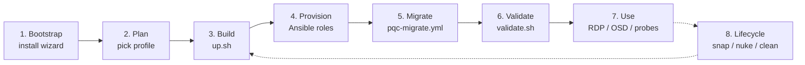
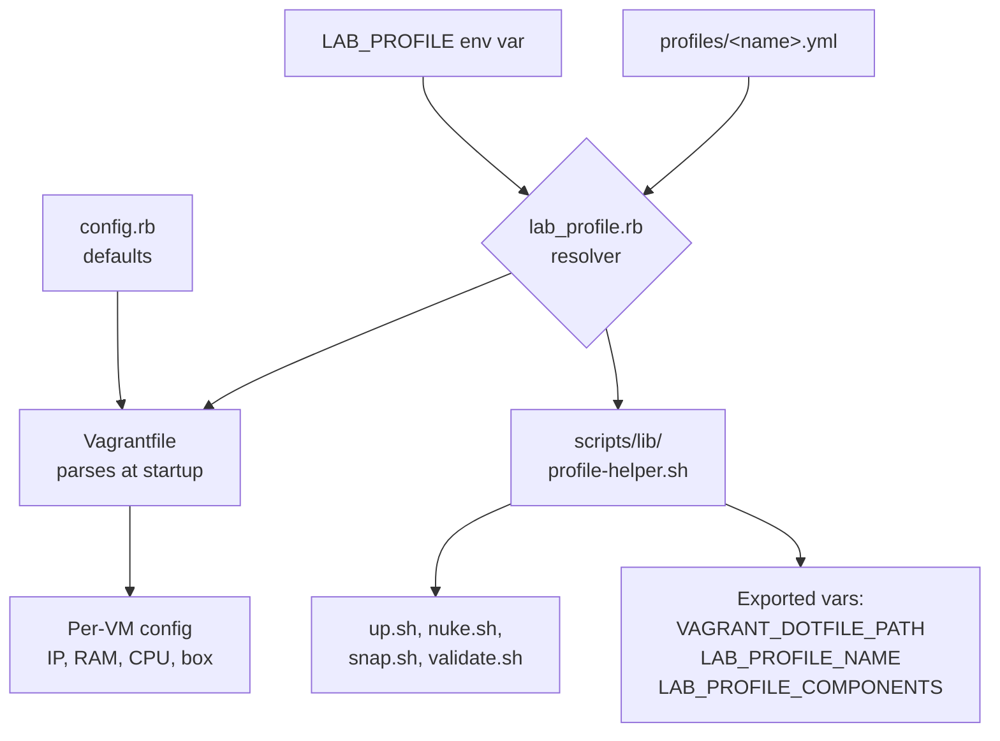
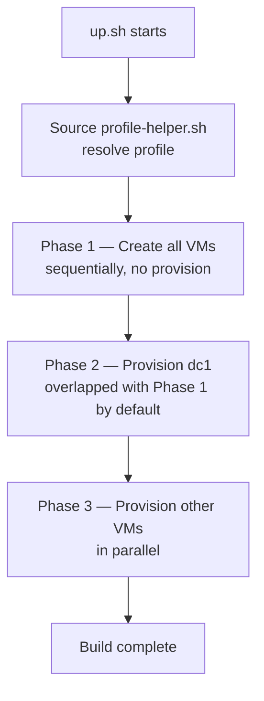
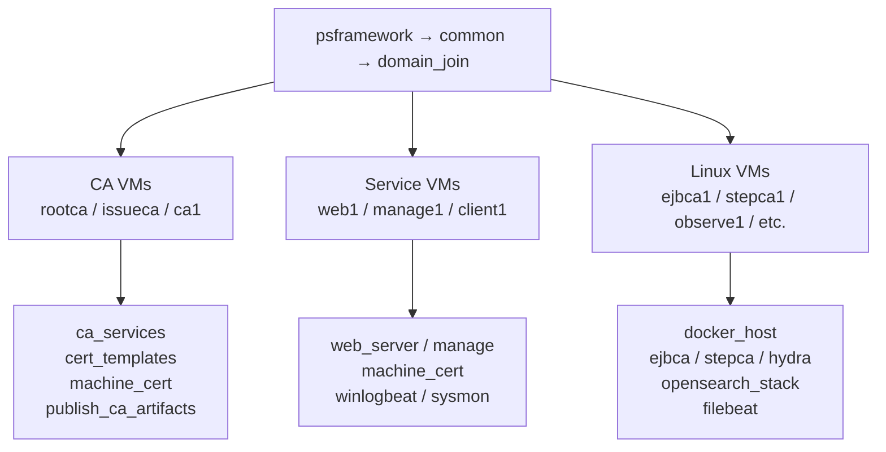
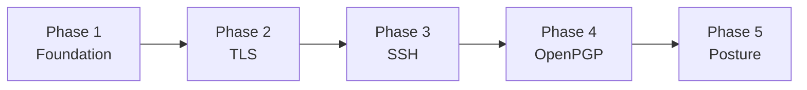
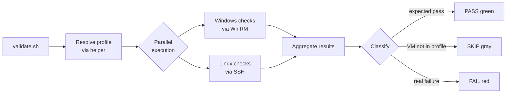
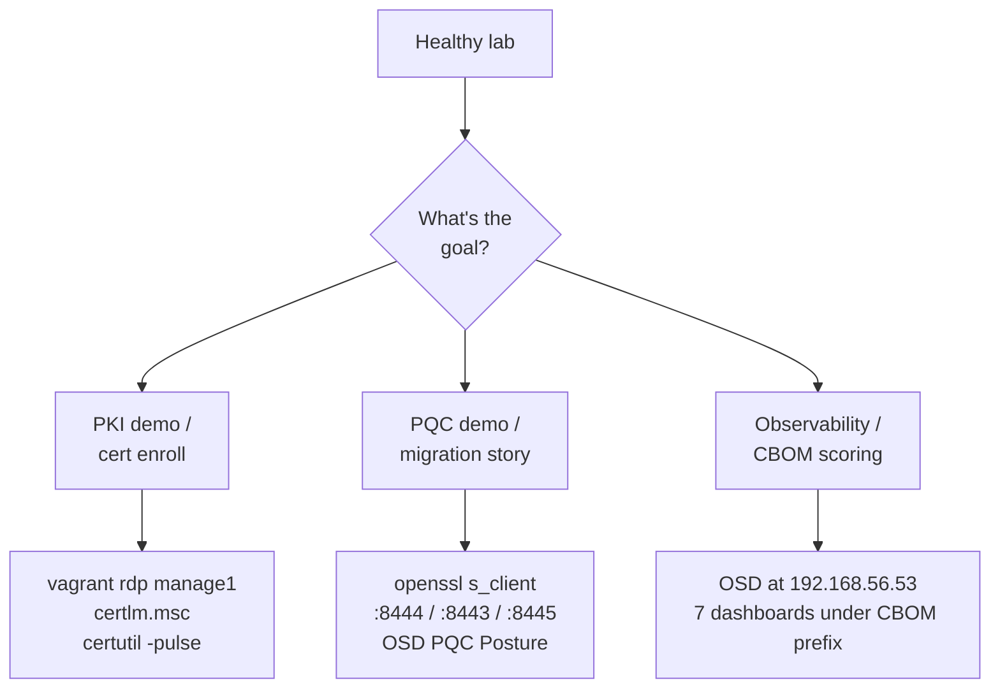
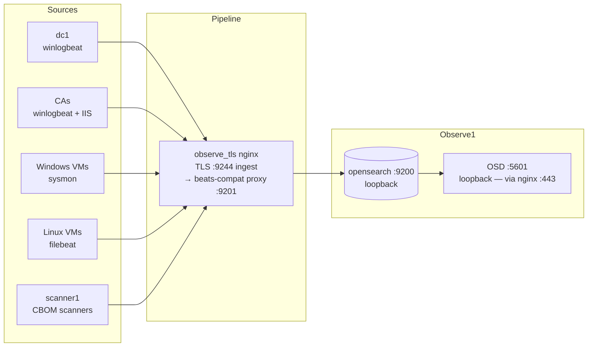
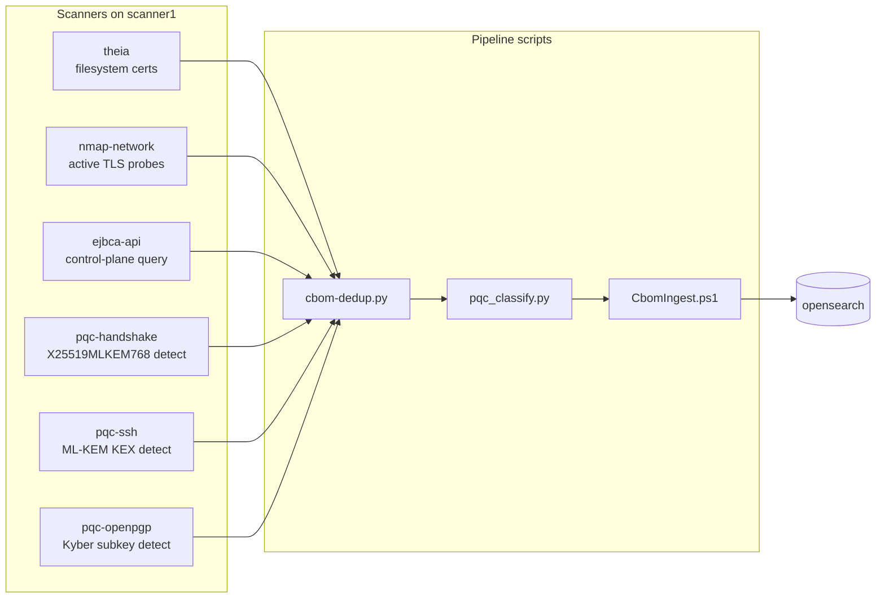

# How Straylight Works

Traces a lab session end-to-end. For static composition + the PQC feature matrix, see [ARCHITECTURE.md](../ARCHITECTURE.md); for the audience-facing demo narrative, [vagrant/docs/pqc-demo-runbook.md](../vagrant/docs/pqc-demo-runbook.md).

## The big picture

A session has eight stages: the first six sequential, the last two cross-cutting.



> 🖌️ **Editable draw.io:** [`diagrams/hiw-big-picture.drawio.svg`](diagrams/hiw-big-picture.drawio.svg)

Stages 4 and 5 happen inside Stage 3 from the user's perspective (`up.sh` calls Ansible; the PQC orchestrator is a separate command for PQC profiles); they're called out separately for their internals.

## Stage 1 — Bootstrap

**`scripts/install-wizard.sh`** is the single entry point for host prerequisites. It detects the host OS (`uname -s` → Linux / Darwin / Windows):

- **Linux (Ubuntu):** apt-based install of VirtualBox + Vagrant + Ansible + Galaxy collections.
- **macOS:** not supported (evaluated and declined; no VirtualBox Apple-Silicon support). Fails fast.
- **Windows:** not supported (evaluated and declined; WSL2 → host-only networking is unguaranteed). Fails fast.

Linux is the only supported host; on other platforms run Straylight inside a Linux VM or on a remote Linux host. `./scripts/install-wizard.sh --list-supported-hosts` prints the current detection result.

What it leaves behind:
- VirtualBox 7.x with Extension Pack
- Vagrant + the `vagrant-vbguest` plugin
- Ansible + `microsoft.ad`, `ansible.windows`, `community.windows`, `community.docker`, `chocolatey.chocolatey` collections
- Your user added to the `vboxusers` group (log out and back in)

## Stage 2 — Plan

A lab profile is a YAML file in `vagrant/profiles/` declaring which VMs the lab consists of.



> 🖌️ **Editable draw.io:** [`diagrams/hiw-plan.drawio.svg`](diagrams/hiw-plan.drawio.svg)

The Ruby resolver (`vagrant/lib/lab_profile.rb`) and the bash helper (`vagrant/scripts/lib/profile-helper.sh`) are the canonical sources of profile state — Ruby for the Vagrantfile, bash for the wrapper scripts (see [Profile resolver](#profile-resolver)).

**Discovery:**

```bash
cd vagrant
./up.sh --list-profiles            # all profiles + descriptions
./up.sh --show-profile pqc-full    # components, dotfile path, VBox prefix
```

**Selection:**

```bash
LAB_PROFILE=pqc-full ./up.sh       # or any other profile
LAB_COMPONENTS=observe1,scanner1 ./up.sh  # ad-hoc component list (no profile)
```

Each profile gets its own `.vagrant-<profile>/` dotfile directory and `straylight-<profile>-` VBox name prefix, so profiles can coexist on one host without colliding.

## Stage 3 — Build (`up.sh` internals)

`up.sh` is the build orchestrator. Its three phases are sequenced to avoid Vagrant lock contention and parallel-launch races.



> 🖌️ **Editable draw.io:** [`diagrams/hiw-build.drawio.svg`](diagrams/hiw-build.drawio.svg)

**Phase 1 — Create.** `vagrant up <vm> --no-provision` for each VM in inventory order, one at a time (parallel imports trigger VirtualBox "Guest-specific operations not ready" races). 1-5 min per VM.

**Phase 2 — DC1 provision.** Everything else depends on AD DS, so dc1 provisions before the rest — but by default its provision starts in the background right after dc1's create, overlapping with the remaining Phase 1 creates (set `LAB_PHASE2_OVERLAP=false` to run it strictly sequentially). Domain promotion takes ~12-15 min including the post-promo reboot; WinRM auth dies during promotion (the `microsoft.ad.domain` module handles re-auth automatically).

**Phase 3 — Parallel provision.** All other VMs provision in parallel. The only stagger is between consecutive CA VMs: `LAB_CA_LAUNCH_STAGGER_SEC` (default 60s) between launches, avoiding a domain_join WMI race when several CA hosts join at once. Wait loops inside Ansible roles handle inter-VM dependencies (machine_cert waits for the CA, domain_join waits for AD DS LDAP, etc.).

Other `up.sh` behaviors:
- **Per-VM logs.** Ansible output for VM `X` lands in `vagrant/logs/<run-id>/X.log`; watch with `tail -f logs/<run-id>/<vm>.log`.
- **Auto-skip provisioned VMs.** If `nltest /dsgetdc:` already returns OK for dc1, Phase 2 is skipped.

## Stage 4 — Provision (Ansible role hierarchy)

Each VM's playbook in `vagrant/ansible/playbooks/<vm>.yml` is a small wrapper including Ansible roles in dependency order.



> 🖌️ **Editable draw.io:** [`diagrams/hiw-provision.drawio.svg`](diagrams/hiw-provision.drawio.svg)

**Universal pre-roles:** Every Windows VM gets `psframework` (logging) + `common` (DNS, NAT cleanup) + `domain_join`. Every Linux VM gets `common_linux`, plus `docker_host` if it runs containers. The playbook then layers in roles specific to that VM's job — see [vagrant/ansible/roles/README.md](../vagrant/ansible/roles/README.md) for the catalog of all 69 roles grouped by capability.

**Two patterns to know:**

1. **Scheduled-task pattern.** Ansible's WinRM connection uses Basic auth → Network logon, which can't authenticate outbound DCOM/RPC. Tasks needing true SYSTEM context (Enterprise CA install, RSAT install, certificate autoenrollment trigger) register a scheduled task running as SYSTEM, then poll for completion. Canonical implementation: `enterprise_ca/tasks/main.yml`.

2. **Idempotency gates.** Every role's `main.yml` opens with a state check (artifact exists? service running? cert present?) and exits early with `changed=0` if so, making `vagrant provision <vm>` safe to re-run.

## Stage 5 — Migrate (PQC profiles only)

For PQC profiles (`pqc-linux`, `pqc-full`), Stage 3+4 builds the infrastructure but no actual PQC. The `pqc-migrate.yml` orchestrator does the cryptographic migration in five phases.



> 🖌️ **Editable draw.io:** [`diagrams/hiw-migrate.drawio.svg`](diagrams/hiw-migrate.drawio.svg)

| Phase | Playbook | What lands |
|---|---|---|
| 1 — Foundation | `pqc-migrate-foundation.yml` | ML-DSA-65 CA hierarchy in EJBCA (Root + Issuing + Chimera Root); ML-DSA-65 leaf certs enrolled on Linux PQC hosts; deployed to `/opt/pqc-certs/`. |
| 2 — TLS | `pqc-migrate-tls.yml` | OpenSSL 3.5 built from source on every PQC host; `openssl s_server` listeners stood up on `:8444` (pure-PQC) and `:8443` (chimera). |
| 3 — SSH | `pqc-migrate-ssh.yml` | OpenSSH 10 built from source on every PQC SSH host; companion `sshd` configured with `mlkem768x25519-sha256` KEX. |
| 4 — OpenPGP | `pqc-migrate-gpg.yml` | GnuPG 2.5.x built from source; lab keys generated with Kyber-768 encryption subkeys. (ML-DSA signing pending GnuPG 2.6.x.) |
| 5 — Posture | `pqc-migrate-posture.yml` | Sweep all six CBOM scanners (theia, nmap-network, ejbca-api, pqc-handshake, pqc-ssh, pqc-openpgp) and re-ingest the results into OpenSearch. |

A separate `pqc-mtls.yml` playbook stands up the pure-PQC mTLS surface on `observe1:8445` + scanner1 client cert; it depends on Phases 1-2, so run it after `pqc-migrate.yml`.

**Run order recap for the full PQC story:**

```bash
LAB_PROFILE=pqc-full ./up.sh
cd ansible
# Use the active profile's inventory (inventory/<profile>/pqc.ini). It intentionally
# omits the lab-wide psf_init / schtask_admin_init vars (those are owned by the
# checked-in ansible/group_vars/all.yml), so pass them to the AD-trust phase.
# NOTE: these values contain spaces, so they MUST go in JSON `-e` form — the
# string `-e key=value` form splits on whitespace and would silently truncate
# psf_init to just ".".
LAB_PROFILE=pqc-full ansible-playbook -i inventory/pqc-full/pqc.ini playbooks/pqc-migrate.yml \
  -e '{"ejbca_token_password":"foo123","psf_init":". C:\\Users\\Public\\Logs\\straylight\\Initialize-PSFLogging.ps1","schtask_admin_init":". C:\\Users\\Public\\Logs\\straylight\\Invoke-StraylightAdminScheduledTask.ps1"}'
LAB_PROFILE=pqc-full ansible-playbook -i inventory/pqc-full/pqc.ini playbooks/pqc-mtls.yml \
  -e ejbca_token_password=foo123
# Re-validate — now exercises the PQC overlay (expect ~231/0/2):
cd .. && VAGRANT_DOTFILE_PATH=.vagrant-pqc-full LAB_PROFILE=pqc-full bash scripts/validate.sh
```

## Stage 6 — Validate

`vagrant/scripts/validate.sh` is the post-build health check — ~300 assertions across all VMs in the active profile, auto-skipping checks against VMs not in the current `LAB_PROFILE`.

The former 2,459-line monolith was decomposed: the ~180-line entrypoint does profile/VM discovery, dispatch, and aggregation; the machinery lives in:
- `vagrant/scripts/lib/validate-harness.sh` — harness core (`record_result`, `launch_check`, WinRM/SSH transports, skip logic).
- `vagrant/scripts/checks/common.sh` — shared PowerShell check snippets.
- `vagrant/scripts/checks/<vm>.sh` — per-VM assertions as `register_checks_<vm>()`.
- `vagrant/scripts/lib/pqc-verify/` — shared PQC probes (TLS pure-leaf, SSH KEX, GnuPG Kyber).

Reliability features: a **vanishing-check guard** FAILs the run if a check that should have registered produced no result (a skipped assertion cannot count as a pass), and each run writes a full transcript to `vagrant/logs/<run-id>/validate.log`.



> 🖌️ **Editable draw.io:** [`diagrams/hiw-validate.drawio.svg`](diagrams/hiw-validate.drawio.svg)

Classifications: **PASS** (green) — check succeeded; **FAIL** (red) — real problem, build is broken; **SKIP** (dim) — the target VM isn't in the active profile.

Baseline for `pqc-full` after the full pipeline: **~231 PASS / 0 FAIL / 2 SKIP** (the 2 SKIPs are the out-of-profile one-tier VMs). If `cloudflare_pqc-*` checks FAIL, the public-endpoint probe is just stale (>12h) — re-run `cloudflare-pqc.service` on scanner1.

## Stage 7 — Use



> 🖌️ **Editable draw.io:** [`diagrams/hiw-use.drawio.svg`](diagrams/hiw-use.drawio.svg)

Each use-case has a runbook:
- **PKI:** [vagrant/docs/lab-topologies.md](../vagrant/docs/lab-topologies.md)
- **PQC:** [vagrant/docs/pqc-demo-runbook.md](../vagrant/docs/pqc-demo-runbook.md)
- **Observability / CBOM:** [vagrant/docs/cbom-pipeline.md](../vagrant/docs/cbom-pipeline.md)

## Stage 8 — Lifecycle operations

| Script | Purpose |
|---|---|
| `vagrant/snap.sh save vm1 [vm2 …] --name X` | Save a VirtualBox snapshot per VM. Profile-aware (snapshots are bound to the active profile's VBox VMs). |
| `vagrant/snap.sh restore vm1 [vm2 …] --name X` | Restore previously-saved snapshots. Fast roll-back from a broken state. |
| `vagrant/nuke.sh --yes-delete-without-prompt` | Destroy every VM in the active profile. Scoped by the profile's dotfile (`VAGRANT_DOTFILE_PATH`); VBox names (`straylight-<profile>-*`) are used only for the up-front parallel hard-poweroff speedup. Other profiles untouched. |
| `vagrant/clean.sh` | Clean up after a Ctrl+C'd `up.sh` run — kills stale vagrant/ansible processes, clears lock files, shows VM status. Doesn't destroy VMs. |
| `vagrant/logging.sh enable\|disable\|status` | Toggle Winlogbeat/Filebeat/Sysmon roles globally for fast iteration without re-enabling logging at every reprovision. |
| `vagrant/provision.sh <vm>` | Re-run Ansible provisioning on an existing VM. Idempotent. |

## Cross-cutting parts

### Profile resolver

Profile state is needed by the Vagrantfile at parse time (Ruby) and by every shell helper script (bash):

- **`vagrant/lib/lab_profile.rb`** — Ruby class, reads `profiles/*.yml`, returns components + resources. Loaded by the Vagrantfile.
- **`vagrant/scripts/lib/profile-helper.sh`** — sourced by `up.sh`/`nuke.sh`/`snap.sh`/`validate.sh`/`provision.sh`. Shells out to the Ruby class for the actual resolve, then exports the resolved fields as environment variables (`LAB_PROFILE_NAME`, `LAB_PROFILE_SOURCE`, `LAB_PROFILE_COMPONENTS`, `VAGRANT_DOTFILE_PATH`, `LAB_VBOX_PREFIX`).

Both call sites read the same YAML, so the implementations can't drift. CI exercises the resolver via a matrix over all 14 profiles to catch schema changes.

### Observability (OBSERVE1)



> 🖌️ **Editable draw.io:** [`diagrams/hiw-observability.drawio.svg`](diagrams/hiw-observability.drawio.svg)

Roles involved:
- **`opensearch_stack`** — installs OpenSearch + OpenSearch Dashboards (both bound to loopback) + a beats-compat proxy listening on `:9201` (mapped to loopback `:9200`; it adds the Beats 8.x compatibility headers OpenSearch doesn't natively accept).
- **`observe_tls`** — nginx TLS termination: OSD served at `https://<observe1>/` on `:443`, Beats/host ingest on `:9244` (`beats_tls_port`) proxying to the loopback `:9200` chain. Cert is ACME-issued from step-ca, with a systemd timer for auto-renewal every 4h.
- **`observe_timer`** — reusable role for the recurring systemd timers on observe1 (cert renewal, periodic CBOM re-ingest, ISM housekeeping).
- **`winlogbeat`, `filebeat`, `filebeat_iis`, `sysmon`, `windows_logging`** — per-VM log shippers.

OpenSearch indices are pre-templated by the `opensearch_stack` role. 7 dashboards with titles prefixed `CBOM:` render PQC posture, log search (Sysmon / Security / PowerShell / AD CS / DNS), and CBOM coverage.

### CBOM pipeline



> 🖌️ **Editable draw.io:** [`diagrams/hiw-cbom.drawio.svg`](diagrams/hiw-cbom.drawio.svg)

The six scanners feed a unified CycloneDX CBOM: `cbom-dedup.py` merges by fingerprint, `pqc_classify.py` tags each component as quantum-vulnerable / PQC / unknown, and `CbomIngest.ps1` (or its Python counterpart `cbom_ingest.py`) pushes the result into OpenSearch via the bulk API. Run the sweep ad-hoc via `vagrant/scripts/cbom-orchestrate.sh` or as part of `pqc-migrate.yml` Phase 5.

A versioned CBOM envelope schema (`vagrant/cbom-toolkit/schema/cbom_envelope.json`) is the single source the OpenSearch index mapping is generated from, so scanner output, ingest payload, and dashboard fields can't drift apart. On observe1, an ISM policy ages CBOM/Beats data out at 14 days and Beats indices are date-suffixed for clean rollover.

## Main parts at a glance

| Part | Path | What it does |
|---|---|---|
| **Vagrantfile** | `vagrant/Vagrantfile` | Single profile-aware Vagrantfile. Defines all 20 VMs; resolves the active profile at parse time and only declares the VMs in it. |
| **Profile catalog** | `vagrant/profiles/*.yml` | 14 declarative lab definitions (components + per-VM resources), including `pqc-adcs-two-tier` (AD CS PQC hierarchy: rootca-pqc ML-DSA-87 + issueca-pqc ML-DSA-65). |
| **Profile resolver** | `vagrant/lib/lab_profile.rb` + `vagrant/scripts/lib/profile-helper.sh` | Twin (Ruby + bash) resolvers — same answers from the same YAML. |
| **Build orchestrator** | `vagrant/up.sh` | 3-phase parallel build with retry + per-VM logs. |
| **Provisioning** | `vagrant/ansible/playbooks/*.yml` + `vagrant/ansible/roles/*` | 69 reusable roles, composed per-VM. |
| **PQC migration** | `vagrant/ansible/playbooks/pqc-migrate*.yml` | 5-phase orchestrator + mTLS playbook. |
| **Validation** | `vagrant/scripts/validate.sh` + `lib/validate-harness.sh` + `checks/<vm>.sh` | ~300 assertions, profile-aware. Decomposed harness + per-VM check files; per-run `validate.log`. |
| **Lifecycle** | `vagrant/{snap,nuke,clean,logging,provision}.sh` | Snapshot, destroy, soft clean, toggle logging, re-provision. |
| **Install wizard** | `scripts/install-wizard.sh` | Single entry point for host prereqs. Host-OS-aware. |
| **CI** | `.github/workflows/ci.yml` + `profile-build.yml` | Lint + ruby tests + profile-resolve matrix on every PR. Weekly self-hosted profile build. |
| **Observability** | `observe1` VM + `opensearch_stack` role | OpenSearch + Dashboards + 7 pre-built dashboards. |
| **CBOM toolkit** | `vagrant/cbom-toolkit/` + `vagrant/scripts/cbom-*.sh` | Six scanners + pipeline + baselines. |

## Pointers to deeper docs

- [ARCHITECTURE.md](../ARCHITECTURE.md) — static composition, topology variants, PQC feature matrix, CBOM data flow. Authoritative VM inventory, CI-checked against `vagrant/topology.yml`.
- [docs/architecture-evolution.md](architecture-evolution.md) — the *why* behind the current architecture (the design decisions that shaped it).
- [vagrant/docs/lab-topologies.md](../vagrant/docs/lab-topologies.md) — one-tier vs two-tier deep-dive.
- [vagrant/docs/pqc-demo-runbook.md](../vagrant/docs/pqc-demo-runbook.md) — narrative for showing the PQC story to an audience.
- [vagrant/docs/cbom-pipeline.md](../vagrant/docs/cbom-pipeline.md) — CBOM scanner architecture + ingestion.
- [vagrant/docs/cbom-toolkit-design.md](../vagrant/docs/cbom-toolkit-design.md) — CBOM toolkit design context.
- [vagrant/docs/ejbca-chimera-setup.md](../vagrant/docs/ejbca-chimera-setup.md) — DB-patch workaround for the chimera catoken.
- [vagrant/ansible/roles/README.md](../vagrant/ansible/roles/README.md) — role catalog grouped by capability.
- [docs/quickstart-walkthrough.md](quickstart-walkthrough.md) — step-by-step first run.
